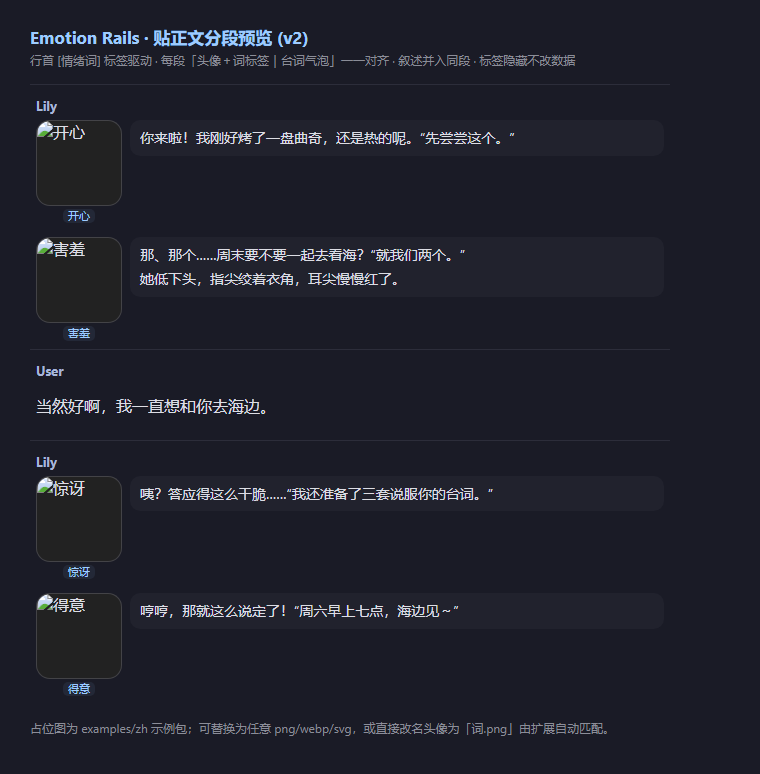

# Emotion Rails

**Render a per-segment emotion avatar beside character messages in SillyTavern, driven by `[emotion-word]` tags at line starts.**

English | [中文](#中文说明)

---

## v2.1.1: per-character path and settings fixes

- Per-character image paths are now resolved beside that character's `emotions.json` (for example, `Alice/emotions.json` + `Alice/happy.png`). v2.1.0 incorrectly resolved relative image paths from the global root.
- `hideStAvatar` and `bubble` now control the rendered layout as documented; character/global caches are isolated by `baseUrl`, index name and mode.
- Formatted leading tags such as `<strong>[happy]</strong> Hello` are hidden correctly, and a late bracket in dialogue can no longer be mistaken for the leading emotion tag.
- The manifest now advertises the project page, auto-update support and the tested minimum SillyTavern version.

## v2.1.0: multi-character vocabularies + missing-art placeholders

- **Per-character**: each message resolves its vocabulary from `mes.ch_name` — `${baseUrl}<character>/emotions.json` (+ its image files) is probed first, then the global `${baseUrl}emotions.json`; if neither exists the character's messages are left completely untouched (ST default rendering). Vocabularies are cached per character; set `perCharacter: false` to use the global list only.
- **Missing art never remaps**: when a word's image file 404s, the segment shows a blank placeholder (inline SVG, no network) instead of borrowing another word's avatar. The word label still shows the intended word.
- Word-list `img` values may be absolute/root-relative URLs or `data:` URIs — used as-is (handy for inline mock art or asset CDNs).

## v2.0.0: from sidebar rail to tag-aligned segments

v1 rendered a single left-float *rail* of avatar chips; because the chips had a fixed pitch while paragraphs varied in height, chips drifted away from their own lines. **v2 replaces the rail with a segmented layout**: each tagged line (plus any untagged narration that follows it) becomes one row of

```
[emotion avatar + word label] | [speech bubble]
```

…so every avatar sits exactly beside its own lines and can never misalign. The leading bracket groups (`[happy]` or `[Name][happy][scene]`) are hidden from display (moved into a hidden span) **without touching the underlying chat data** — regex, export and copy still see the original text.

> Breaking change from v1: the extension now restructures the message text DOM (`.mes_text`) instead of rendering a sibling rail. See *Coexistence* below if you run another extension that also rewrites message text.

## Origin: built so emotion avatars and per-sentence TTS can coexist

This extension exists because in our local-agent roleplay setup, **per-sentence TTS emotion control and custom expression avatars needed to share one vocabulary**:

- Character reply lines start with cues like `[开心]`. The TTS side consumes **the same words** to switch per-sentence emotion reference audio — so avatars must be driven by that very word list. The official [Character Expressions](https://docs.sillytavern.app/extensions/expression-images/) extension is message-level only and uses a fixed English label set + classifier, so it can't hook into a shared custom vocabulary.
- The TTS extension injects its per-sentence player UI **inside** `.mes_text`. v1 therefore rendered as a sibling rail and never touched message text DOM. **v2's segment layout does restructure `.mes_text`** — so coexistence is now enforced by design: idempotent re-rendering (content hash), a MutationObserver that rebuilds the segments if another extension rewrites the text, preserved `data-*` markers, and a generation-streaming gate that never interrupts the typewriter (verified alongside a per-sentence TTS player on ST 1.18).
- The agent replies through an OpenAI-compatible streaming endpoint; its media-inclusion mechanism passes raw directives through as plain text while streaming, so images cannot be delivered that way — rendering must happen client-side, from the tags themselves.
- Both sides fall back silently (the TTS backend quietly drops to neutral audio when an emotion word is missing; this extension quietly falls back to the fallback word). Vocabulary drift between the two was painful to debug — hence one shared `emotions.json` with aliases as the single source of truth.

**You don't need any of that infrastructure**: Emotion Rails runs standalone with any word list you put in `emotions.json`.



## Features

- 🏷️ **Tag-driven**: lines starting with `[happy]`, `[害羞]`, … get their own avatar + speech bubble; unknown words silently fall back (whitelist → alias → fallback word).
- 📐 **Tag-aligned segments**: avatar column is part of each segment, so it tracks its own lines — no float drift, no pitch math.
- 🕶️ **Tag hiding**: `[word]` prefixes are hidden from display; chat data is never modified.
- 🧩 **Coexistence**: rendering is idempotent (content-hash guard) and a MutationObserver re-renders a message when another extension rewrites `.mes_text`; the observer suspends during streaming generation so the typewriter is never interrupted; other extensions' DOM markers (`data-*` on `.mes_text`, injected node attributes) are preserved.
- 📦 **Data-driven**: whitelist, aliases and fallback are all defined in one `emotions.json`. No hardcoded vocabulary.
- 🔁 **Always fresh**: full-history render on chat load; instant re-render on edit/swipe; ST's persistent left avatar is hidden on segmented messages (each segment has its own).

## Install

In SillyTavern: **Extensions → Install extension**, paste this repository URL.

Manual alternative: clone into `data/<user-handle>/extensions/st-emotion-rails/`.

## Quick start

1. Create the asset folder: `data/<user-handle>/images/emotion-rails/`
2. Copy **one** example pack into it (`examples/zh/*` or `examples/en/*`), keeping the structure:
   ```
   emotion-rails/
   ├── emotions.json
   └── avatars/
       ├── happy.svg
       └── …
   ```
   Replace the placeholder SVGs with your own images later — any browser-renderable format works (`png`/`webp`/`svg`); either name files `<word>.png` or point to them explicitly in `emotions.json`.
3. Hard-refresh the SillyTavern page (**Ctrl+F5**).
4. Send a test message as the character, e.g. `[happy] Hello there!` — the line should render as an avatar + speech bubble row.

## `emotions.json` format

```json
{
  "fallback": "calm",
  "happy":   { "img": "avatars/happy.svg" },
  "calm":    { "img": "avatars/calm.svg" },
  "aliases": { "glad": "happy", "pensive": "thinking" }
}
```

| Key | Meaning |
|---|---|
| `<word>` | Emotion word exactly as used inside `[...]`. Value: `{ "img": "<path relative to the selected emotions.json folder>" }` — absolute `http(s):`/`data:`/`blob:` and origin-root (`/...`) URLs are used as-is |
| `aliases` | Extra words mapped to a canonical word (e.g. the model writes `[excited]` but you only have art for `happy`) |
| `fallback` | Word used for untagged lines and unrecognized words (overridden by the `defaultWord` setting if set) |

## Extension settings

Stored under `extension_settings.emotionRails`:

| Key | Default | Meaning |
|---|---|---|
| `enabled` | `true` | Master switch |
| `baseUrl` | `/user/images/emotion-rails/` | Where `emotions.json` and images live; per-character subfolders go under it |
| `index` | `emotions.json` | Index file name |
| `perCharacter` | `true` | Probe `${baseUrl}<character>/emotions.json` first, then the global list |
| `defaultWord` | *(empty)* | Overrides `fallback` from the JSON |
| `showChip` | `true` | Show the word label under each avatar |
| `size` | `84` | Segment avatar size in px |
| `hideStAvatar` | `true` | Hide ST's persistent left avatar on segmented messages |
| `bubble` | `true` | Speech-bubble background behind segment text |
| `placeholder` | `true` | Missing art shows a blank placeholder (never remapped to another word's avatar) |

**Per-character layout** (with `perCharacter: true`):

```
user/images/emotion-rails/
├── emotions.json              # global (optional fallback; all characters)
├── happy.svg                  # global art (optional)
└── Alice/
    ├── emotions.json          # Alice's own vocabulary (probed first)
    └── happy.svg              # Alice's own art
```

Each folder is matched to a character by `mes.ch_name` (the character's display name). Characters without a vocabulary are left untouched.

## For extension developers: the ST message contract

These cost us a debugging session — save yours (verified on ST 1.18.x):

- `CHARACTER_MESSAGE_RENDERED` / `MESSAGE_EDITED` / `MESSAGE_SWIPED` emit **positional args** `(messageId, type)` where `messageId` is the **array index** — not `{ messageId }`.
- Chat items have **no `id` field**; the array index *is* the message id.
- Message blocks locate via the bare attribute `.mes[mesid="<index>"]` — there are **no `data-*` attributes**.
- `GENERATION_ENDED` passes `chat.length` (not an index).
- ⚠ **`messageFormatting` renders each line as a `<p>` element** — `showdown` `simpleLineBreaks` only converts in-line `\n` to `<br>`; blank lines delimit paragraphs, so there are **no `<br>` children at the `.mes_text` top level**. Any code that splits message text on `<br>` gets one giant "line" and misbehaves. (A streaming typewriter may briefly produce the raw `<br>` shape — support both.)
- Loading an existing chat fires **no render events** — rescan the whole chat yourself on `CHAT_CHANGED`/startup.
- Other extensions may rewrite `.mes_text` asynchronously (e.g. per-sentence TTS players polling after render events). Re-render idempotently and preserve `dataset` markers, or the two extensions will fight forever.

## Troubleshooting

- **No segments at all** → check the extension is enabled in the Extensions panel (a disabled entry persists server-side in `settings.json → extension_settings.disabledExtensions`; a hard refresh won't fix that). Then check the console for `[emotionRails]` logs and make sure `${baseUrl}emotions.json` (or the character's own folder) returns HTTP 200.
- **One character shows raw tags while others work** → that character has no vocabulary (no `${baseUrl}<character>/emotions.json`, no global index). Add one, or give the character its own folder. This is the "leave untouched" behavior by design.
- **Only the first segment has an avatar** → the page is probably still serving a cached older build; hard-refresh (**Ctrl+F5**) after updating (or clear the service-worker cache).
- **Tags stay visible** → the first node of the line is not a plain text node (rare). The extension hides whole-element tags as a fallback; report it with an `outerHTML` sample.
- **Segments come back after a swipe but text is doubled** → another extension rewrote `.mes_text` without preserving markers; check their re-render order (ours re-renders 500 ms after any change).

Tested on SillyTavern **1.18.x**. If it works (or breaks) on another version, an issue is appreciated.

For a dependency-free core regression check, run `node --test tests/core.test.mjs` from the repository root.

## License

[MIT](LICENSE)

---

# 中文说明

**在 SillyTavern 里，按角色台词行首的 `[情绪词]` 标签，将消息渲染成"每段头像+词标签 | 台词气泡"的贴正文分段样式。**

## v2.1.1：角色路径与设置修复

- 角色专属词表内的相对图片路径现在会正确相对于该角色目录解析（例如 `Alice/emotions.json` + `Alice/happy.png`）；v2.1.0 会错误地去全局根目录找图。
- `hideStAvatar` 与 `bubble` 现在会按文档真正控制布局；角色/全局缓存按 `baseUrl`、索引名和模式隔离。
- `<strong>[开心]</strong> 台词` 这类带格式的行首标签可以正确隐藏，台词后部出现的方括号也不会再被误判成行首情绪。
- manifest 已补齐项目主页、自动更新和最低 SillyTavern 版本信息。

## v2.1.0：多角色词表 + 缺图空白占位

- **多角色**：每条消息按 `mes.ch_name` 解析词表——先探测 `${baseUrl}<角色名>/emotions.json`（及其图片），再回退全局 `${baseUrl}emotions.json`；两者都没有则该角色消息**完全不介入**（保持 ST 默认渲染）。词表按角色缓存；设置 `perCharacter: false` 可只用全局词表。
- **缺图不映射**：词表内某词的图片文件 404 时，该段显示**空白占位图**（内联 SVG，无网络请求），而不是借用其它词的头像；词标签仍显示本来的词。
- 词表 `img` 值支持**绝对/站点根路径 URL 与 data: URI**（原样使用，便于内联示例图或走图床）。

## v2.0.0：从侧栏 rail 改为贴正文分段

v1 版把表情 chip 渲染成消息左侧一整列浮块（rail）；因为 chip 间距固定而段落高度不一，头像会逐步漂离自己的台词。**v2 改为分段布局**：每个带标签的行（及其后跟随的叙述行）组成一行

```
[表情头像 + 情绪词标签] | [台词气泡]
```

头像永远贴在各自段落的左侧，结构上不可能再错位。行首方括号组（`[开心]` 或 `[角色][情绪][场景]`）**从显示中隐藏**（移入隐藏 span），但**不改底层聊天数据**——正则替换、导出、复制看到的仍是原文。

> 相对 v1 的破坏性变更：本扩展现在会重组消息正文 DOM（`.mes_text`），而不再是渲染侧栏兄弟节点。若你同时使用其它改写消息正文的扩展，请阅读下方"共存"说明。

## 缘起：为「表情头像 × 逐句 TTS」共存而生

本插件源起于本地 agent 驱动的酒馆 RP 场景：**逐句 TTS 情绪控制与自定义表情头像需要共用同一份词表**——

- 角色台词行首带 `[开心]` 这类情绪词，TTS 侧用**同一套词**切换逐句情绪参考音频——头像必须吃同一份词表。官方 [Character Expressions](https://docs.sillytavern.app/extensions/expression-images/) 是消息级整图 + 固定英文标签集 + 分类器路线，接不上自定义共享词表。
- TTS 扩展会在 `.mes_text` **内部**注入逐句播放按钮。v1 因此把侧栏渲染为兄弟节点、从不碰正文 DOM；**v2 的分段布局确实会重组 `.mes_text`**，所以共存改为"机制保障"：内容哈希幂等重排 + MutationObserver 检测他方重写后自动重建 + 保留 `data-*` 标记 + 流式生成期挂起不打断打字机（已在 1.18 上与逐句播放器实测共存）。
- agent 走 OpenAI 兼容流式接口回复；流式下其媒体内嵌机制会把原始指令当纯文本透传，图片没法走那条路——渲染只能在酒馆前端由标签驱动完成，这正是本插件做的事。
- 两端都有静默回落（TTS 后端情绪词缺失时悄悄退回中性音色；本插件未识别词悄悄退回兜底词），两边词表一旦漂移极难排查——所以用一份带别名的 `emotions.json` 作为唯一真源。

**不搭这套基础设施也完全能用**：Emotion Rails 单独即可运行，`emotions.json` 词表随你放。


## 特性

- 🏷️ **标签驱动**：`[开心]` `[惊讶]` 等行首标签各行渲染为"头像 + 台词气泡"；词表外词汇按 白名单 → 别名 → 兜底词 静默回落。
- 📐 **贴正文分段**：头像列是每段自身的一部分，跟着自己的段落走——没有浮动漂移、没有间距计算。
- 🕶️ **标签隐藏**：`[词]` 前缀从显示中隐藏；聊天数据零改动。
- 🧩 **共存**：渲染幂等（内容哈希防抖）；MutationObserver 检测到其它扩展重写 `.mes_text` 后自动重排；流式生成期间观察器挂起，不打断打字机；其它扩展在 DOM 上的标记（`data-*`、节点注入属性）原样保留。
- 📦 **数据驱动**：白名单/别名/兜底词全部在一个 `emotions.json` 里，增删情绪不改代码。
- 🔁 **始终新鲜**：聊天加载全历史补渲染；编辑/滑动即时重渲染；分段消息上自动隐藏酒馆左侧常驻头像（每段自带头像）。

## 安装

酒馆 → 扩展面板 → Install extension，粘贴本仓库地址；或手动克隆到 `data/<用户>/extensions/st-emotion-rails/`。

## 快速上手

1. 建素材目录 `data/<用户>/images/emotion-rails/`
2. 拷入任意一套示例包（`examples/zh/*` 或 `examples/en/*`），保持 `emotions.json + avatars/` 结构；之后可随时把占位 SVG 换成自己的 png/webp 图（文件名 `<词>.png` 或在 json 里显式指定）。
3. **Ctrl+F5** 硬刷新页面。
4. 让角色发一条 `[开心] 测试消息` —— 该行应渲染成"头像+气泡"行。

## `emotions.json` 格式

```json
{
  "fallback": "平静",
  "开心": { "img": "avatars/开心.svg" },
  "aliases": { "高兴": "开心", "沉思": "思考" }
}
```

- `<词>`：与方括号里写的字面一致；值为 `{ "img": "相对当前 emotions.json 所在目录的路径" }`——绝对 `http(s):`/`data:`/`blob:` 与站点根路径（`/...`）URL 原样使用
- `aliases`：别名 → 规范词（模型输出 `[激动]` 但你只有「开心」的图时很有用）
- `fallback`：无标签行与未识别词的兜底词（设置里的 `defaultWord` 可覆盖它）

## 扩展设置

存于 `extension_settings.emotionRails`：

| 键 | 默认 | 含义 |
|---|---|---|
| `enabled` | `true` | 总开关 |
| `baseUrl` | `/user/images/emotion-rails/` | `emotions.json` 与图片所在目录；角色子目录放其下 |
| `index` | `emotions.json` | 索引文件名 |
| `perCharacter` | `true` | 先探测 `${baseUrl}<角色名>/emotions.json`，没有则回退全局 |
| `defaultWord` | *(空)* | 覆盖 JSON 里的 `fallback` |
| `showChip` | `true` | 头像下方显示情绪词标签 |
| `size` | `84` | 段头像边长(px) |
| `hideStAvatar` | `true` | 分段消息上隐藏 ST 常驻左侧头像 |
| `bubble` | `true` | 台词气泡背景 |
| `placeholder` | `true` | 图片缺失显示空白占位（不映射到其它词头像） |

**多角色目录布局**（`perCharacter: true` 时）：

```
data/<用户>/images/emotion-rails/
├── emotions.json              # 全局（可选，所有角色兜底）
├── happy.svg                  # 全局图（可选）
└── Alice/
    ├── emotions.json          # Alice 自己的词表（优先探测）
    └── happy.svg              # Alice 自己的图
```

文件夹按 `mes.ch_name`（角色显示名）匹配；没有词表的角色消息保持 ST 原样不介入。

## 写给扩展开发者：ST 消息契约（1.18.x 实测）

这些坑我们调试了很久——帮你省一下：

- `CHARACTER_MESSAGE_RENDERED` / `MESSAGE_EDITED` / `MESSAGE_SWIPED` 是**位置参数** `(messageId, type)`，其中 `messageId` 是**数组下标**——不是 `{ messageId }` 对象。
- 聊天条目**没有 `id` 字段**；数组下标就是消息 id。
- 消息块的选择器是裸属性 `.mes[mesid="<下标>"]`——**没有 `data-*` 属性**。
- `GENERATION_ENDED` 传的是 `chat.length`（不是下标）。
- ⚠ **`messageFormatting` 把每一行渲染成一个 `<p>` 元素**——`showdown` 的 `simpleLineBreaks` 只把行内 `\n` 转 `<br>`，空行是段落分隔，所以 `.mes_text` 顶层**没有 `<br>` 子节点**。任何按 `<br>` 切分的代码都会把整条消息当成"一行"然后出问题。（流式打字机中间态可能短暂是 `<br>` 形态——两种都兼容。）

## 排障

- **完全不显示** → 先看扩展面板是否被禁用（禁用状态持久化在服务器 `settings.json` 的 `disabledExtensions` 里，硬刷新无效）；再看 console 有没有 `[emotionRails]` 日志；最后确认 `${baseUrl}emotions.json`（或该角色的子目录）返回 200。
- **别的角色都正常、某角色标签原样显示** → 该角色没有词表（既无 `${baseUrl}<角色名>/emotions.json` 也无全局索引）。补一份，或给它建自己的文件夹——这是"无词表不介入"的设计行为。
- **只有第一段有头像** → 页面很可能还在执行旧版缓存脚本；升级后 **Ctrl+F5** 硬刷新（或临时清一次 service worker 缓存）。
- **标签仍显示在正文里** → 该行首节点不是纯文本节点（少见）；扩展会作整元素隐藏兜底；如仍复现请附带 `outerHTML` 片段反馈。
- **滑动后分段回来了但正文重复** → 别的扩展重写了 `.mes_text` 且没保留标记；我们会在任何变更后 500ms 自动重排，检查两者的事件顺序。

已在 SillyTavern **1.18.x** 实测；其它版本欢迎反馈 issue。

无需安装依赖的核心回归检查：在仓库根目录运行 `node --test tests/core.test.mjs`。

## 许可

[MIT](LICENSE)
